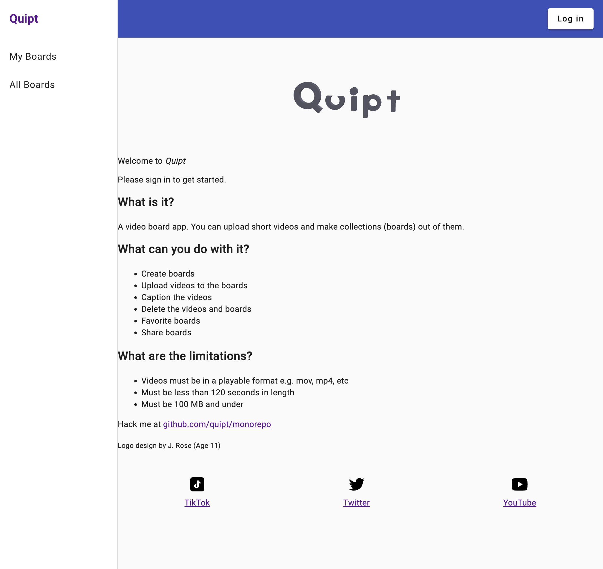
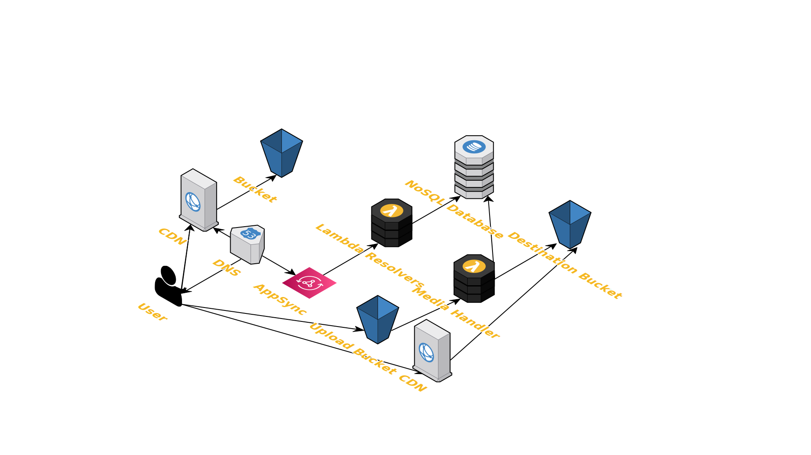

# What is it?
- A full-stack web application in a monorepo
- TypeScript all the way... CDK for IaC, Angular front-end, AppSync & TypeScript lambda backends
- The CDK Pipeline
  - Builds and deploys the pipeline itself
  - Builds the lambda functions and angular application
  - Deploys the CloudFormation and Angular application for each environment

# What can you do with it?
- Log in with Auth0
- Upload short videos and make boards out of them
- Favorite a board
- Share boards with permanent URLs
- Caption the videos
- Delete videos and boards

# Screenshot

# Architecture

# Repository layout
This repository utilizes yarn workspaces. All of the modules are stored under the `packages` directory. Each module has its own README file, which describes its functionality in detail.

## `packages/api`
Contains the Lambda for the AppSync API

## `packages/aws`
Contains the Cloud Development Kit (CDK) / Infrastructure as Code implementation

## `packages/media-handler`
A Docker-based Lambda function that transforms the video that was uploaded to the S3 upload bucket and then uploads it to the output bucket

## `packages/web`
The front-end Angular web application

# Areas that need improvement
- Testing
  - cdk
  - angular
  - lambda
  - synthetics
- UI
  - Home page (logged in and logged out)
  - All/my boards list, need to paginate
  - Implement features on the features list
- The GraphQL API schema
  - Pagination