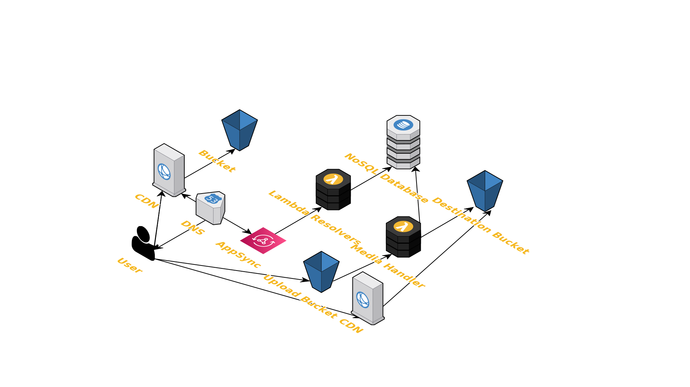

# Welcome to the Quipt CDK TypeScript project!

The `cdk.json` file tells the CDK Toolkit how to execute your app.

## Useful commands

 * `yarn build`           compile typescript to js
 * `yarn watch`           watch for changes and compile
 * `yarn test`            perform the jest unit tests
 * `yarn cdk deploy`      deploy this stack to your default AWS account/region
 * `yarn cdk diff`        compare deployed stack with current state
 * `yarn cdk synth`       emits the synthesized CloudFormation template

# Architecture

